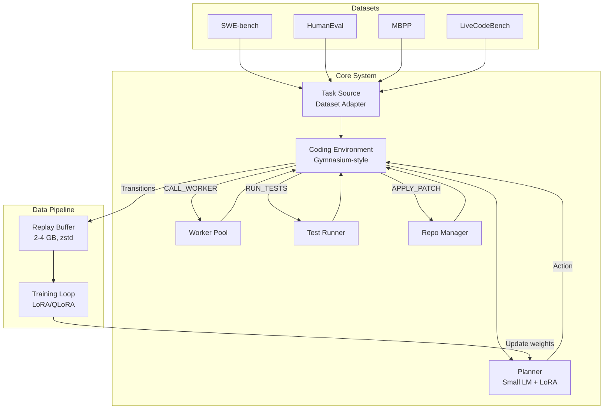

# Coding-Oriented LLM Orchestrator (Fugu-Inspired)

A small orchestration model that learns how to coordinate multiple coding LLMs, treating orchestration as an MDP and training a lightweight planner via LoRA/QLoRA.

## Resolved Decisions

| Decision | Choice |
|----------|--------|
| **Planner Base Model** | `Qwen/Qwen2.5-3B-Instruct` (QLoRA fine-tuning) |
| **Worker Hosting** | vLLM on H200s, one instance per model, same host, different ports |
| **Primary Dataset** | SWE-bench Lite (300 tasks) |
| **Training GPU** | H200 (80GB HBM3) — ample headroom |
| **Worker Endpoints** | `http://<host>:8001/v1` (Qwen 27B), `:8002` (Gemma), `:8003` (Ornith) — source of truth: `configs/default.yaml` |

> [!WARNING]
> **Disk Budget**: The spec calls for ~10 GB total disk. SWE-bench repos alone can be large (e.g., Django ~200MB). The streaming pipeline with aggressive cleanup is essential. The replay buffer is capped at 2-4 GB leaving ~6 GB for working space.

---

## Architecture Overview



---

## Proposed Changes

### 1. Project Skeleton & Configuration

Sets up the Python package structure, dependency management, and configuration system.

#### [NEW] [pyproject.toml](file:///Users/rohangoel/Documents/antigravity/clever-turing/pyproject.toml)
- Project metadata, dependencies (`torch`, `transformers`, `peft`, `datasets`, `gymnasium`, `zstandard`, `gitpython`, `pydantic`)
- Dev dependencies (`pytest`, `ruff`, `mypy`)
- Entry points for CLI commands (`fugu-train`, `fugu-collect`, `fugu-eval`)

#### [NEW] [src/fugu/\_\_init\_\_.py](file:///Users/rohangoel/Documents/antigravity/clever-turing/src/fugu/__init__.py)
- Package root

#### [NEW] [src/fugu/config.py](file:///Users/rohangoel/Documents/antigravity/clever-turing/src/fugu/config.py)
- Pydantic settings for all configuration: model paths, worker endpoints, training hyperparams, buffer size, disk limits
- YAML/env-var backed configuration

---

### 2. Action Space & State Representation

Defines the MDP formalism — the action enum, state schema, and transition dataclass.

#### [NEW] [src/fugu/core/actions.py](file:///Users/rohangoel/Documents/antigravity/clever-turing/src/fugu/core/actions.py)
```python
from enum import IntEnum

class PlannerAction(IntEnum):
    CALL_QWEN = 0
    CALL_GEMMA = 1
    CALL_ORNITH = 2
    RUN_TESTS = 3
    VERIFY = 4
    RETRY = 5
    STOP = 6
```
- `IntEnum` for direct use as class indices in cross-entropy loss
- Extensible: future actions just append to the enum

#### [NEW] [src/fugu/core/state.py](file:///Users/rohangoel/Documents/antigravity/clever-turing/src/fugu/core/state.py)
- `PlannerState` dataclass:
  - `task_description: str` — the coding task / issue text
  - `repo_context: str` — summarized repository info (file tree, relevant files)
  - `history: list[HistoryEntry]` — previous (action, outcome) pairs
  - `test_results: TestResults` — pass/fail counts, error messages
  - `compile_status: bool`
  - `current_patch: str` — git diff of current modifications
  - `step_number: int`
  - `remaining_budget: float` — optional token/cost budget
- `Transition` dataclass: `(state, action, reward, next_state, metadata)`
- `Metadata` dataclass: worker used, tests before/after, tokens, latency, files modified
- Method `to_prompt() -> str` that serializes state into planner input text

#### [NEW] [src/fugu/core/reward.py](file:///Users/rohangoel/Documents/antigravity/clever-turing/src/fugu/core/reward.py)
- `RewardCalculator` with configurable weights:
  ```python
  reward = (
      w_tests * (tests_after - tests_before) / max(total_tests, 1)
      + w_compile * compile_success
      - w_cost * normalized_token_cost
      - w_latency * normalized_latency
      - w_retry * is_retry
  )
  ```
- Terminal bonus for all tests passing
- Penalty for exceeding budget

---

### 3. Worker Interface

Abstraction layer for coding worker models. All workers implement the same interface.

#### [NEW] [src/fugu/workers/base.py](file:///Users/rohangoel/Documents/antigravity/clever-turing/src/fugu/workers/base.py)
```python
from abc import ABC, abstractmethod
from dataclasses import dataclass

@dataclass
class WorkerResponse:
    patch: str           # git diff format
    explanation: str     # reasoning (for logging only)
    tokens_used: int
    latency_ms: float

class BaseWorker(ABC):
    @abstractmethod
    async def generate(
        self,
        prompt: str,
        repository: "RepoContext",
        history: list["HistoryEntry"],
        test_results: "TestResults | None" = None,
    ) -> WorkerResponse: ...
```

#### [NEW] [src/fugu/workers/qwen.py](file:///Users/rohangoel/Documents/antigravity/clever-turing/src/fugu/workers/qwen.py)
- `QwenWorker(BaseWorker)` — calls Qwen 27B via HTTP API (OpenAI-compatible endpoint)

#### [NEW] [src/fugu/workers/gemma.py](file:///Users/rohangoel/Documents/antigravity/clever-turing/src/fugu/workers/gemma.py)
- `GemmaWorker(BaseWorker)` — calls Gemma 27B/31B via HTTP API

#### [NEW] [src/fugu/workers/ornith.py](file:///Users/rohangoel/Documents/antigravity/clever-turing/src/fugu/workers/ornith.py)
- `OrnithWorker(BaseWorker)` — calls Ornith via HTTP API

#### [NEW] [src/fugu/workers/mock.py](file:///Users/rohangoel/Documents/antigravity/clever-turing/src/fugu/workers/mock.py)
- `MockWorker(BaseWorker)` — returns pre-recorded or random patches for testing
- Essential for offline development and unit tests

#### [NEW] [src/fugu/workers/pool.py](file:///Users/rohangoel/Documents/antigravity/clever-turing/src/fugu/workers/pool.py)
- `WorkerPool` — maps `PlannerAction` → `BaseWorker` instance
- Factory method that reads config and instantiates appropriate workers

---

### 4. Repository Management

Handles git operations with extreme disk efficiency — one repo at a time, clone-process-delete.

#### [NEW] [src/fugu/repo/manager.py](file:///Users/rohangoel/Documents/antigravity/clever-turing/src/fugu/repo/manager.py)
- `RepoManager`:
  - `clone(repo_url, commit_hash) -> Path` — shallow clone (`--depth=1`) + checkout specific commit
  - `apply_patch(patch: str) -> bool` — apply git diff, return success
  - `get_diff() -> str` — current working tree diff
  - `reset()` — hard reset to base commit
  - `cleanup()` — delete cloned repo entirely
  - `disk_usage() -> int` — current repo size in bytes
- Uses `gitpython` for git operations
- Workspace directory configurable, defaults to `./workspace/repos/`

#### [NEW] [src/fugu/repo/context.py](file:///Users/rohangoel/Documents/antigravity/clever-turing/src/fugu/repo/context.py)
- `RepoContext`:
  - Generates file tree summary (truncated to fit context window)
  - Extracts relevant files based on test errors and task description
  - Caches context between planner steps (invalidated on patch apply)

---

### 5. Test Runner

Executes tests in the cloned repository and captures results.

#### [NEW] [src/fugu/execution/runner.py](file:///Users/rohangoel/Documents/antigravity/clever-turing/src/fugu/execution/runner.py)
- `TestRunner`:
  - `run_tests(repo_path, test_commands) -> TestResults` — subprocess execution with timeout
  - `compile_check(repo_path) -> CompileResult` — syntax/import validation
- `TestResults` dataclass: `passed: int, failed: int, errors: int, output: str, duration_ms: float`
- Timeout handling (configurable, default 300s)
- Sandboxed execution (subprocess with resource limits)

---

### 6. Dataset Adapters

Common interface abstracting all supported benchmarks. Each adapter yields `CodingTask` instances.

#### [NEW] [src/fugu/datasets/base.py](file:///Users/rohangoel/Documents/antigravity/clever-turing/src/fugu/datasets/base.py)
```python
@dataclass
class CodingTask:
    task_id: str
    repo_url: str | None        # None for standalone tasks (HumanEval)
    base_commit: str | None
    problem_statement: str
    test_patch: str | None      # For SWE-bench
    test_command: str | None    # How to run tests
    gold_patch: str | None      # Reference solution
    fail_to_pass: list[str]     # Tests that should go from fail→pass
    pass_to_pass: list[str]     # Tests that should remain passing
    metadata: dict

class BaseDataset(ABC):
    @abstractmethod
    def __iter__(self) -> Iterator[CodingTask]: ...

    @abstractmethod
    def group_by_repo(self) -> dict[str, list[CodingTask]]: ...
```

#### [NEW] [src/fugu/datasets/swebench.py](file:///Users/rohangoel/Documents/antigravity/clever-turing/src/fugu/datasets/swebench.py)
- Loads from `princeton-nlp/SWE-bench_Lite` or `princeton-nlp/SWE-bench` via HuggingFace `datasets`
- Groups tasks by `repo` field for efficient sequential processing
- Orders repos by task count (descending) to maximize throughput

#### [NEW] [src/fugu/datasets/humaneval.py](file:///Users/rohangoel/Documents/antigravity/clever-turing/src/fugu/datasets/humaneval.py)
- Loads from `openai/openai_humaneval`
- No repo management needed — creates temporary single-file workspace
- Test command: `python -m pytest {file}`

#### [NEW] [src/fugu/datasets/mbpp.py](file:///Users/rohangoel/Documents/antigravity/clever-turing/src/fugu/datasets/mbpp.py)
- Loads from `google-research-datasets/mbpp`
- Similar to HumanEval — standalone tasks

#### [NEW] [src/fugu/datasets/livecodebench.py](file:///Users/rohangoel/Documents/antigravity/clever-turing/src/fugu/datasets/livecodebench.py)
- Stub adapter for LiveCodeBench (to be implemented when needed)

---

### 7. Coding Environment (Gymnasium-style)

The central orchestration loop, modeled as a Gymnasium environment.

#### [NEW] [src/fugu/env/coding_env.py](file:///Users/rohangoel/Documents/antigravity/clever-turing/src/fugu/env/coding_env.py)
```python
class CodingEnvironment:
    """
    Gymnasium-style environment for coding task orchestration.

    Observation: PlannerState (serialized to text for the planner LM)
    Action: PlannerAction (discrete, 7 actions)
    Reward: composite reward from RewardCalculator
    """
    def __init__(self, task, repo_manager, worker_pool, test_runner, reward_calc, max_steps=10):
        ...

    def reset(self) -> PlannerState:
        """Clone repo, apply test patch, run baseline tests, return initial state."""
        ...

    def step(self, action: PlannerAction) -> tuple[PlannerState, float, bool, dict]:
        """
        Execute action:
        - CALL_WORKER: dispatch to appropriate worker, apply returned patch
        - RUN_TESTS: execute test suite
        - VERIFY: run tests + compile check
        - RETRY: re-run last worker with updated context
        - STOP: terminate episode
        Returns: (next_state, reward, done, info)
        """
        ...

    def close(self):
        """Cleanup: delete repo, release resources."""
        ...
```

- Each episode = one coding task
- `max_steps` prevents infinite loops (default 10)
- Automatically records transitions for the replay buffer
- Async worker calls for latency measurement

---

### 8. Trajectory Generation & Strategies

Generates training data by running coding tasks through fixed orchestration strategies.

#### [NEW] [src/fugu/trajectory/strategies.py](file:///Users/rohangoel/Documents/antigravity/clever-turing/src/fugu/trajectory/strategies.py)
- Fixed strategies for initial data collection:
  ```python
  class SingleWorkerStrategy:
      """CALL_WORKER → RUN_TESTS → STOP"""

  class RetryOnFailStrategy:
      """CALL_WORKER → RUN_TESTS → (if fail) RETRY → RUN_TESTS → STOP"""

  class MultiWorkerStrategy:
      """CALL_QWEN → RUN_TESTS → (if fail) CALL_GEMMA → RUN_TESTS → STOP"""

  class VerifyFirstStrategy:
      """CALL_WORKER → VERIFY → (if fail) CALL_DIFFERENT_WORKER → VERIFY → STOP"""
  ```
- Each strategy is a simple generator that yields `PlannerAction` given current state

#### [NEW] [src/fugu/trajectory/collector.py](file:///Users/rohangoel/Documents/antigravity/clever-turing/src/fugu/trajectory/collector.py)
- `TrajectoryCollector`:
  - Runs a strategy through the environment
  - Collects `Transition` tuples
  - Computes per-step and episode-level rewards
  - Streams transitions to the replay buffer
  - Deletes temporary artifacts after each episode

---

### 9. Replay Buffer

Fixed-size, compressed storage for planner training data.

#### [NEW] [src/fugu/buffer/replay_buffer.py](file:///Users/rohangoel/Documents/antigravity/clever-turing/src/fugu/buffer/replay_buffer.py)
- `ReplayBuffer`:
  - Backed by memory-mapped file + index for persistence
  - Fixed capacity (configurable, default ~500K transitions targeting 2-4 GB)
  - FIFO eviction when full (oldest samples removed)
  - All entries compressed with `zstandard`
  - Methods: `add(transition)`, `sample(batch_size)`, `save()`, `load()`
  - Tracks disk usage and raises alarm if approaching limit
- Storage format: each transition is a zstd-compressed MessagePack blob
- Index file maps transition_id → (offset, length) in the data file

---

### 10. Planner Model

The small language model that predicts orchestration actions.

#### [NEW] [src/fugu/planner/model.py](file:///Users/rohangoel/Documents/antigravity/clever-turing/src/fugu/planner/model.py)
- `PlannerModel`:
  - Loads base model (e.g., `Qwen/Qwen2.5-3B-Instruct`) with QLoRA config
  - LoRA config: `r=16`, `alpha=32`, target modules `["q_proj", "v_proj", "k_proj", "o_proj"]`
  - Quantization: 4-bit NF4 via `bitsandbytes`
  - Adds classification head on top of last hidden state → 7 action logits
  - Inference: `predict(state: PlannerState) -> PlannerAction` (argmax of logits)
  - Also exposes `predict_proba()` for exploration during RL

#### [NEW] [src/fugu/planner/tokenizer.py](file:///Users/rohangoel/Documents/antigravity/clever-turing/src/fugu/planner/tokenizer.py)
- State serialization: converts `PlannerState` → tokenized input
- Template:
  ```
  <|task|>{problem_statement}<|/task|>
  <|repo|>{repo_context}<|/repo|>
  <|history|>{action_1}: {outcome_1}\n{action_2}: {outcome_2}<|/history|>
  <|tests|>passed: {n}, failed: {m}, errors: {e}<|/tests|>
  <|compile|>{status}<|/compile|>
  <|step|>{step_number}/{max_steps}<|/step|>
  ```
- Truncation strategy: prioritize task + recent history, truncate repo context

---

### 11. Training Loop

LoRA fine-tuning of the planner on collected transitions.

#### [NEW] [src/fugu/training/trainer.py](file:///Users/rohangoel/Documents/antigravity/clever-turing/src/fugu/training/trainer.py)
- `PlannerTrainer`:
  - Samples batches from replay buffer
  - Supervised learning: cross-entropy loss over action labels
  - Optimizer: AdamW with cosine schedule
  - Gradient accumulation for effective larger batch size
  - Checkpointing every N steps
  - Evaluation: accuracy on held-out transitions
  - Logs to console/file (no WandB dependency by default, optional integration)

#### [NEW] [src/fugu/training/data.py](file:///Users/rohangoel/Documents/antigravity/clever-turing/src/fugu/training/data.py)
- `TransitionDataset(torch.utils.data.Dataset)`:
  - Wraps replay buffer for PyTorch DataLoader compatibility
  - Handles tokenization and padding
  - Returns `(input_ids, attention_mask, action_label)`

---

### 12. CLI & Entry Points

Command-line interface for running each stage of the pipeline.

#### [NEW] [src/fugu/cli/collect.py](file:///Users/rohangoel/Documents/antigravity/clever-turing/src/fugu/cli/collect.py)
- `fugu-collect` command:
  - `--dataset {swebench-lite, humaneval, mbpp}`
  - `--strategy {single, retry, multi, verify}`
  - `--max-tasks N`
  - `--workers mock` (for testing)
  - Runs trajectory collection → replay buffer

#### [NEW] [src/fugu/cli/train.py](file:///Users/rohangoel/Documents/antigravity/clever-turing/src/fugu/cli/train.py)
- `fugu-train` command:
  - `--base-model Qwen/Qwen2.5-3B-Instruct`
  - `--lora-rank 16`
  - `--epochs 3`
  - `--batch-size 8`
  - Runs LoRA fine-tuning on replay buffer data

#### [NEW] [src/fugu/cli/eval.py](file:///Users/rohangoel/Documents/antigravity/clever-turing/src/fugu/cli/eval.py)
- `fugu-eval` command:
  - `--model path/to/checkpoint`
  - `--dataset {swebench-lite, humaneval, mbpp}`
  - `--max-tasks N`
  - Runs trained planner through environment, reports metrics

---

### 13. Tests

#### [NEW] [tests/test_actions.py](file:///Users/rohangoel/Documents/antigravity/clever-turing/tests/test_actions.py)
- Verify action enum values and conversions

#### [NEW] [tests/test_state.py](file:///Users/rohangoel/Documents/antigravity/clever-turing/tests/test_state.py)
- State serialization/deserialization, prompt generation

#### [NEW] [tests/test_reward.py](file:///Users/rohangoel/Documents/antigravity/clever-turing/tests/test_reward.py)
- Reward calculation with various scenarios

#### [NEW] [tests/test_workers.py](file:///Users/rohangoel/Documents/antigravity/clever-turing/tests/test_workers.py)
- Mock worker tests, worker pool dispatch

#### [NEW] [tests/test_env.py](file:///Users/rohangoel/Documents/antigravity/clever-turing/tests/test_env.py)
- Full environment episode with mock workers

#### [NEW] [tests/test_buffer.py](file:///Users/rohangoel/Documents/antigravity/clever-turing/tests/test_buffer.py)
- Replay buffer add/sample/eviction/persistence

#### [NEW] [tests/test_datasets.py](file:///Users/rohangoel/Documents/antigravity/clever-turing/tests/test_datasets.py)
- Dataset adapter loading and iteration

---

## File Structure Summary

```
clever-turing/
├── pyproject.toml
├── README.md
├── configs/
│   └── default.yaml
├── src/
│   └── fugu/
│       ├── __init__.py
│       ├── config.py
│       ├── core/
│       │   ├── __init__.py
│       │   ├── actions.py
│       │   ├── state.py
│       │   └── reward.py
│       ├── workers/
│       │   ├── __init__.py
│       │   ├── base.py
│       │   ├── qwen.py
│       │   ├── gemma.py
│       │   ├── ornith.py
│       │   ├── mock.py
│       │   └── pool.py
│       ├── repo/
│       │   ├── __init__.py
│       │   ├── manager.py
│       │   └── context.py
│       ├── execution/
│       │   ├── __init__.py
│       │   └── runner.py
│       ├── datasets/
│       │   ├── __init__.py
│       │   ├── base.py
│       │   ├── swebench.py
│       │   ├── humaneval.py
│       │   ├── mbpp.py
│       │   └── livecodebench.py
│       ├── env/
│       │   ├── __init__.py
│       │   └── coding_env.py
│       ├── trajectory/
│       │   ├── __init__.py
│       │   ├── strategies.py
│       │   └── collector.py
│       ├── buffer/
│       │   ├── __init__.py
│       │   └── replay_buffer.py
│       ├── planner/
│       │   ├── __init__.py
│       │   ├── model.py
│       │   └── tokenizer.py
│       ├── training/
│       │   ├── __init__.py
│       │   ├── trainer.py
│       │   └── data.py
│       └── cli/
│           ├── __init__.py
│           ├── collect.py
│           ├── train.py
│           └── eval.py
└── tests/
    ├── conftest.py
    ├── test_actions.py
    ├── test_state.py
    ├── test_reward.py
    ├── test_workers.py
    ├── test_env.py
    ├── test_buffer.py
    └── test_datasets.py
```

---

## Implementation Phases

### Phase 1: Foundation (Core + Mock Pipeline)
Build the skeleton so the full loop works end-to-end with mock workers:
1. Project setup (`pyproject.toml`, package structure)
2. Core types (`actions.py`, `state.py`, `reward.py`)
3. Worker interface + mock worker
4. Test runner (subprocess-based)
5. Repository manager
6. Coding environment
7. One dataset adapter (HumanEval — simplest)
8. Fixed trajectory strategies
9. Replay buffer
10. Unit tests for all of the above

**Exit criteria**: Can run `fugu-collect --dataset humaneval --workers mock --strategy single` and see transitions in the replay buffer.

### Phase 2: Planner Model + Training
1. Planner model with LoRA/QLoRA setup
2. State tokenization
3. Training data pipeline
4. Training loop
5. Basic evaluation

**Exit criteria**: Can run `fugu-train` on collected data and `fugu-eval` shows the planner making non-random action predictions.

### Phase 3: Real Workers + SWE-bench
1. Implement real worker adapters (Qwen, Gemma, Ornith)
2. SWE-bench dataset adapter with repo grouping
3. Disk-aware repo management (clone-process-delete)
4. End-to-end trajectory collection on SWE-bench Lite

### Phase 4: RL Fine-tuning (Future)
1. Replace cross-entropy with policy gradient / PPO
2. Self-play trajectory generation
3. Online learning loop

---

## Verification Plan

### Automated Tests
```bash
# Run full test suite
pytest tests/ -v

# Run with coverage
pytest tests/ --cov=src/fugu --cov-report=term-missing

# Type checking
mypy src/fugu/

# Linting
ruff check src/ tests/
```

### Integration Verification
1. **Mock end-to-end**: Run `fugu-collect` with mock workers on HumanEval, verify transitions are stored correctly
2. **Replay buffer stress**: Fill buffer to capacity, verify FIFO eviction and disk usage stays within limits
3. **Training smoke test**: Train planner for 10 steps on mock data, verify loss decreases
4. **Environment episode**: Run a complete episode with mock workers, verify state transitions and reward calculations

### Manual Verification
- Inspect serialized planner states for readability and completeness
- Review reward values for sanity (positive for test improvements, negative for costs)
- Verify disk cleanup after repo processing
